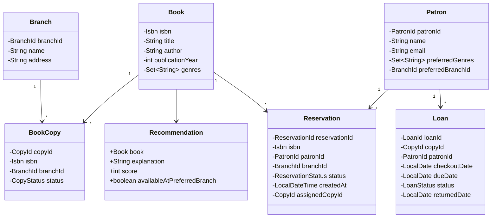

# UniqueLeaf Library Core

## Overview

I built this project as an in-memory Java Library Management System for an OOP and SOLID assignment. The main idea behind the design is to keep book details separate from actual physical copies, so the system can handle inventory, borrowing, reservations, and branch transfers in a cleaner way.

The project supports multiple branches, keeps borrowing history, handles reservation queues, sends notifications when a reserved copy becomes available, and includes a recommendation feature based on patron preferences and borrowing history.

## Features

- Book catalog management
- Patron management
- Checkout and return
- Inventory tracking
- Borrowing history
- Multi-branch support
- Branch transfers
- Reservation queue with FIFO ordering
- Reservation notifications
- Recommendation generation
- Logging through SLF4J and Logback
- JUnit 5 test suite with unit and integration coverage

## Unique Design Choices

- I kept `Book` and `BookCopy` separate on purpose. `Book` represents the title and metadata, while `BookCopy` represents an actual copy that can be checked out or moved between branches.
- I made the reservation flow a bit more realistic. If a returned copy already has people waiting for it, it does not become generally available right away. It moves into `RESERVED_HOLD` and the next patron gets notified.
- Recommendations are not hard-coded into one service method. The scoring logic is handled through strategy classes, and then the service also considers whether the book is available at the patron's preferred branch.
- All repositories are interfaces with in-memory implementations, which made the code easier to test and easier to extend later.
- I used a small event system so reservation notifications are triggered by events instead of tightly coupling everything inside one method.

## OOP Concepts

### Encapsulation

- `BookCopy` controls its own branch and status changes through methods like `withStatus()` and `moveToBranch()`.
- `Loan` and `Reservation` handle their own state changes through methods like `markReturned()`, `markNotified()`, and `markFulfilled()`.

### Abstraction

- Repository interfaces keep storage details separate from service logic.
- `LoanPolicy` separates borrowing rules from `LendingService`.
- `RecommendationStrategy` separates recommendation logic from the service layer.

### Polymorphism

- `GenreAffinityRecommendationStrategy` and `AuthorAffinityRecommendationStrategy` are two interchangeable implementations of `RecommendationStrategy`.
- `StandardLoanPolicy` is one implementation of `LoanPolicy`.
- `ReservationNotificationListener` implements `DomainEventListener` and can be swapped or extended with more listeners later.

### Composition

- The services are built by combining repositories, factories, policies, and the event publisher instead of relying on inheritance.
- `RecommendationService` combines strategy-based scoring with inventory availability checks.

## SOLID Principles

### Single Responsibility Principle

- `CatalogService` handles catalog records and copy registration.
- `LendingService` handles loans and copy circulation state.
- `ReservationService` handles reservation queues and reservation updates.
- `ReservationNotificationListener` only handles sending reservation availability notifications.

### Open/Closed Principle

- New recommendation approaches can be added by implementing `RecommendationStrategy`.
- New borrowing rules can be added by implementing `LoanPolicy`.
- New event listeners can be added without changing the existing services.

### Liskov Substitution Principle

- `RecommendationService` works with either recommendation strategy without needing internal changes.
- `LendingService` depends on the `LoanPolicy` interface instead of a concrete class.

### Interface Segregation Principle

- The repository interfaces are small and focused.
- I avoided using one oversized manager or one catch-all repository interface.

### Dependency Inversion Principle

- The services depend on repository interfaces rather than concrete map implementations.
- Notification handling depends on the `NotificationChannel` interface instead of one fixed implementation.

## Design Patterns

### Observer Pattern

- `DomainEventPublisher` publishes events like checkout, return, reservation creation, reservation availability, and branch transfer.
- `ReservationNotificationListener` listens for a reserved copy becoming available and sends a notification to the next patron.

### Factory Pattern

- `BookFactory` validates ISBN, title, author, and publication year before creating a `Book`.
- `PatronFactory` validates name and email before creating a `Patron`.

### Strategy Pattern

- `RecommendationStrategy` is the extension point.
- `GenreAffinityRecommendationStrategy` scores books by genre overlap.
- `AuthorAffinityRecommendationStrategy` scores books by prior author affinity.

### Policy Pattern

- `LoanPolicy` defines rules like maximum active loans and due-date calculation.
- `StandardLoanPolicy` contains the default borrowing rules used in this project.

## Class Diagram

### Core Domain Diagram



### Service And Infrastructure Diagram

```mermaid
classDiagram
    class CatalogService
    class PatronService
    class LendingService
    class ReservationService
    class BranchService
    class RecommendationService

    class BookRepository
    class BookCopyRepository
    class PatronRepository
    class BranchRepository
    class LoanRepository
    class ReservationRepository

    class DomainEventPublisher
    class DomainEventListener
    class ReservationNotificationListener
    class NotificationChannel

    class RecommendationStrategy
    class GenreAffinityRecommendationStrategy
    class AuthorAffinityRecommendationStrategy

    class LoanPolicy
    class StandardLoanPolicy

    CatalogService --> BookRepository
    CatalogService --> BookCopyRepository
    CatalogService --> BranchRepository
    PatronService --> PatronRepository
    PatronService --> LoanRepository
    LendingService --> BookCopyRepository
    LendingService --> LoanRepository
    LendingService --> ReservationService
    LendingService --> LoanPolicy
    LendingService --> DomainEventPublisher
    ReservationService --> ReservationRepository
    ReservationService --> BookCopyRepository
    ReservationService --> DomainEventPublisher
    BranchService --> BranchRepository
    BranchService --> BookCopyRepository
    BranchService --> DomainEventPublisher
    RecommendationService --> PatronRepository
    RecommendationService --> BookRepository
    RecommendationService --> BookCopyRepository
    RecommendationService --> LoanRepository
    RecommendationService --> RecommendationStrategy

    DomainEventPublisher --> DomainEventListener
    ReservationNotificationListener ..|> DomainEventListener
    ReservationNotificationListener --> NotificationChannel
    GenreAffinityRecommendationStrategy ..|> RecommendationStrategy
    AuthorAffinityRecommendationStrategy ..|> RecommendationStrategy
    StandardLoanPolicy ..|> LoanPolicy
```



### Diagram Legend

| Arrow | Meaning |
| --- | --- |
| `A --> B` | `A` is associated with, uses, or depends on `B` |
| `A ..|> B` | `A` implements or realizes interface `B` |
| `"1" --> "*"` | one-to-many relationship |

In the domain diagram, multiplicity is shown where it matters. In the service diagram, most `-->` arrows simply mean one class depends on another.

## Sample Workflows

### Add Book

1. Create a validated `Book` with `BookFactory`.
2. Save the title-level record through `CatalogService.addBook()`.
3. Register one or more `BookCopy` instances at branches with `CatalogService.registerPhysicalCopy()`.

### Checkout

1. Choose a `BookCopy` at a branch.
2. Call `LendingService.checkoutCopy()`.
3. The service enforces the `LoanPolicy`, marks the copy `CHECKED_OUT`, creates a `Loan`, and publishes `BookCheckedOutEvent`.

### Return

1. Call `LendingService.returnCopy()`.
2. The loan becomes `RETURNED`.
3. If no queue exists, the copy becomes `AVAILABLE`.
4. If a queue exists, the copy becomes `RESERVED_HOLD` and the next patron is notified.

### Reserve

1. Call `ReservationService.reserveBook()` with patron, ISBN, and preferred branch.
2. The service rejects the reservation if an immediately available copy already exists at that branch.
3. Otherwise it creates a `WAITING` reservation and preserves FIFO order.

### Transfer

1. Call `BranchService.transferCopy()` with the copy and destination branch.
2. The service blocks transfer if the copy is checked out or already in reserved hold.
3. A successful transfer publishes `BookTransferredEvent`.

### Recommend

1. Call `RecommendationService.recommendForPatron()`.
2. The service excludes already borrowed books.
3. The injected strategy computes base affinity.
4. The service boosts items available at the patron's preferred branch and returns short explanations.

## How to Run

Run the full test suite:

```bash
mvn clean test
```

Run the small demo scenario:

```bash
mvn exec:java
```

## Testing

The test suite is business-focused and uses real in-memory repositories rather than mocks.

- `BookFactoryTest` validates ISBN, title, and publication year rules.
- `PatronFactoryTest` validates name and email rules.
- `CatalogServiceTest` covers add, update, search, copy registration, and safe removal.
- `LendingServiceTest` covers checkout, return, policy enforcement, and history updates.
- `ReservationServiceTest` covers FIFO reservations, hold behavior, and notifications.
- `BranchServiceTest` covers transfers and blocked transfers.
- `RecommendationServiceTest` covers genre ranking, author ranking, borrowed-book exclusion, and availability weighting.
- `UniqueLeafIntegrationTest` verifies the full multi-branch workflow with Asha Mehta, Kabir Sen, and Mira Rao.

## Limitations

- In-memory only; data disappears when the process ends.
- No authentication or authorization layer.
- No database or persistence framework.
- No REST API, web UI, or desktop UI.
- Notification delivery is in-memory only; there is no external email or SMS provider.
